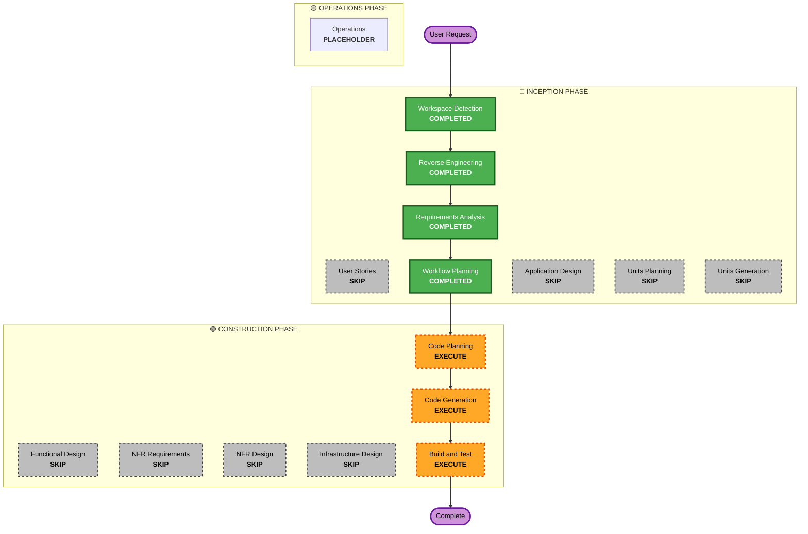

# Execution Plan

## Detailed Analysis Summary

### Transformation Scope (Brownfield Only)
- **Transformation Type**: Single component
- **Primary Changes**: Addition of `Avatar.tsx` (PNGtuber component).
- **Related Components**: Future usage in `src/Composition.tsx` or `src/slides/*`.

### Change Impact Assessment
- **User-facing changes**: No (Video outputs only)
- **Structural changes**: No (Standard component addition)
- **Data model changes**: No
- **API changes**: No
- **NFR impact**: Yes (Strict adherence to deterministic `useCurrentFrame` animations without CSS transitions).

### Component Relationships (Brownfield Only)
The `Avatar.tsx` will reside in `src/components/` and be imported by any composition requiring character animation.

### Risk Assessment
- **Risk Level**: Low
- **Rollback Complexity**: Easy
- **Testing Complexity**: Simple (Visual check via `npm run start`)

## Workflow Visualization

## Phases to Execute

### 🔵 INCEPTION PHASE
- [x] Workspace Detection (COMPLETED)
- [x] Reverse Engineering (COMPLETED)
- [x] Requirements Elaboration (COMPLETED)
- [x] User Stories (SKIPPED)
- [x] Execution Plan (COMPLETED)
- [x] Application Design - SKIP
  - **Rationale**: Simple single-component addition without complex architecture needs.
- [x] Units Planning - SKIP
  - **Rationale**: The change logic resides within a single component.
- [x] Units Generation - SKIP
  - **Rationale**: Single unit task.

### 🟢 CONSTRUCTION PHASE
- [x] Functional Design - SKIP
  - **Rationale**: Data-to-render logic is fully described in the requirements.
- [x] NFR Requirements - SKIP
  - **Rationale**: Documented in the Requirements phase.
- [x] NFR Design - SKIP
  - **Rationale**: Handled during code structure.
- [x] Infrastructure Design - SKIP
  - **Rationale**: No external deployment changes.
- [ ] Code Planning - EXECUTE (ALWAYS)
  - **Rationale**: Implementation approach needed
- [ ] Code Generation - EXECUTE (ALWAYS)
  - **Rationale**: Code implementation needed
- [ ] Build and Test - EXECUTE (ALWAYS)
  - **Rationale**: Build, test, and verification needed

### 🟡 OPERATIONS PHASE
- [ ] Operations - PLACEHOLDER
  - **Rationale**: Future deployment and monitoring workflows

## Estimated Timeline
- **Total Phases Executing**: 3 remaining (Code Planning, Code Generation, Build and Test)
- **Estimated Duration**: ~1 hour

## Success Criteria
- **Primary Goal**: Implement `Avatar.tsx` according to non-functional Remotion rules without using CSS transitions.
- **Key Deliverables**: `Avatar.tsx` and updated export locations.
- **Quality Gates**: Component renders cleanly and passes basic `npm run build` constraints without UI bugs.
