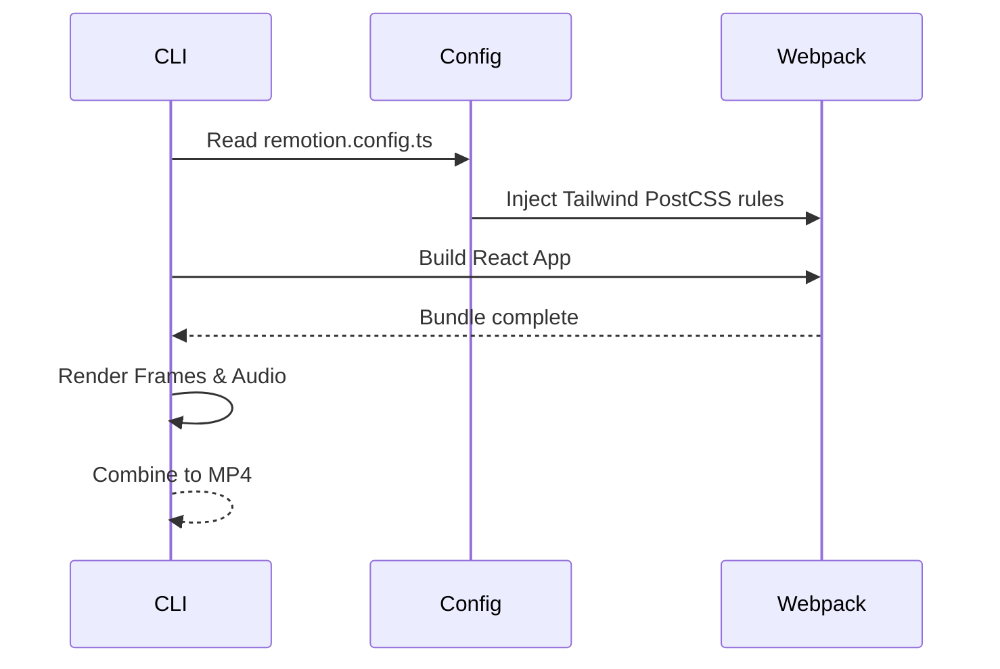

# System Architecture

## System Overview
A React-based video generation pipeline utilizing the Remotion framework to produce `.mp4` files from code.

## Architecture Diagram
```mermaid
flowchart TD
    Build[Build System (npm/webpack)] --> Entry[src/index.ts]
    Entry --> Root[Root.tsx]
    Root --> Comp1[WorkflowVideo.tsx]
    Root --> Comp2[AIGovernanceVideo.tsx]
    Comp1 --> Slides[src/slides/*]
    Comp2 --> Slides
```

## Component Descriptions
### Root
- **Purpose**: Registration of Remotion Compositions.
- **Responsibilities**: Define `Composition` definitions and base props.
- **Dependencies**: Remotion core.
- **Type**: Application Entry

## Data Flow


## Integration Points
- **External APIs**: None (Static video rendering)
- **Databases**: None
- **Third-party Services**: None

## Infrastructure Components
- **Deployment Model**: Local rendering via Node.js / CLI. Outputs `.mp4`.
