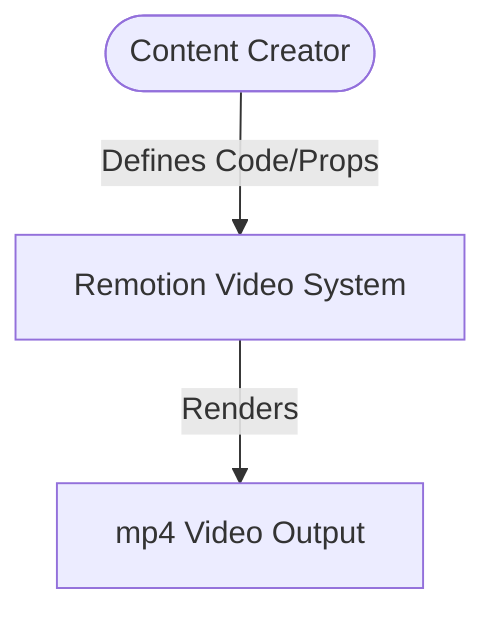

# Business Overview

## Business Context Diagram

## Business Description
- **Business Description**: This system is a programmatically driven video creation project using Remotion. It allows content creators and developers to define animations, slides, and video structure using React code instead of traditional video editing software.
- **Business Transactions**: 
  - Render Video: Render specified composition via `remotion render`.
  - Preview Video: Preview composition in real-time via `remotion preview`.
- **Business Dictionary**: 
  - Composition: A Remotion concept representing a complete video or major section.
  - Frame: The atomic unit of time within the Remotion rendering timeline.

## Component Level Business Descriptions
### Web/Video Presentation
- **Purpose**: Creates slide-like presentations and animated infographics.
- **Responsibilities**: Layout management, timing control, transition rendering.
