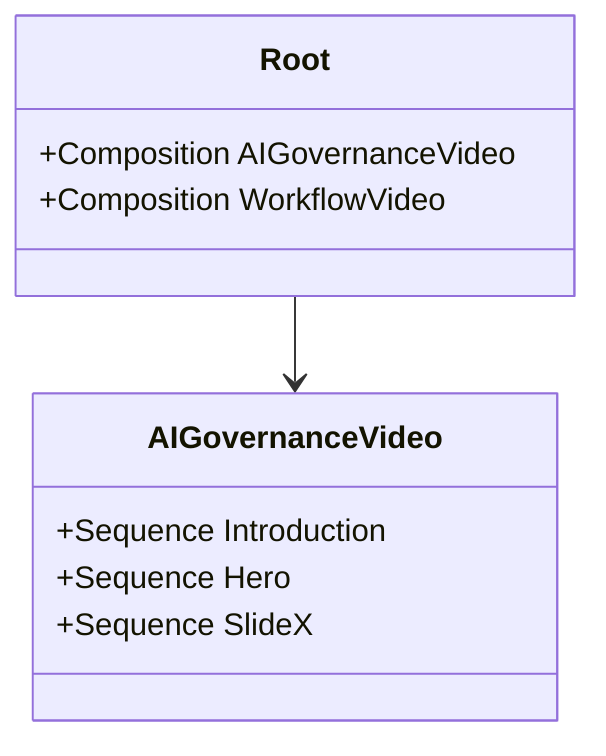

# Code Structure

## Build System
- **Type**: npm / Remotion CLI / Webpack internals
- **Configuration**: `remotion.config.ts`, `package.json`, `tailwind.config.js`, `postcss.config.js`

## Key Classes/Modules

### Existing Files Inventory
- `src/index.ts` - Entry point registering the root component.
- `src/Root.tsx` - Defines Remotion Compositions exposed to the CLI.
- `src/Composition.tsx` - Base template or example composition.
- `src/AIGovernanceVideo.tsx` - AI Governance presentation composition bringing together multiple sequences/slides.
- `src/WorkflowVideo.tsx` - Workflow-related presentation composition.
- `src/style.css` - Global stylesheet (Tailwind directives).
- `src/slides/` - Contains slide components for rendering specific scenes.
- `src/components/` - Currently empty, target for shared UI elements like Avatars.

## Design Patterns
### React Component Composition
- **Location**: Throughout `src/`
- **Purpose**: Modularity and reusability of scenes.
- **Implementation**: Pure functional components returning Remotion `Sequence` and HTML tags.

## Critical Dependencies
### Remotion Core
- **Version**: ^4.0.409
- **Usage**: Globally for `Sequence`, `Composition`, `Img`, `Audio`.
- **Purpose**: Engine for rendering code to video.
