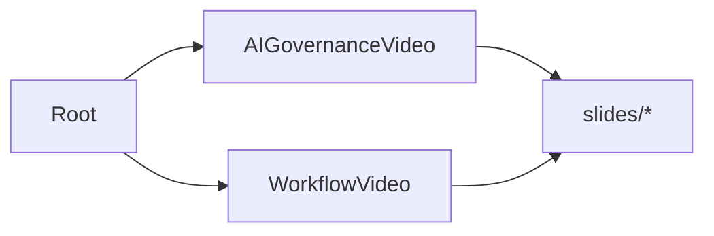

# Dependencies

## Internal Dependencies

### Components depend on React
- **Type**: Compile/Runtime
- **Reason**: React provides the JSX execution and component architecture.

## External Dependencies
### @remotion/cli, @remotion/player, @remotion/renderer
- **Version**: ^4.0.409
- **Purpose**: Remotion video framework tooling.
- **License**: Custom (Remotion specific licensing).

### React
- **Version**: ^19.2.3
- **Purpose**: Defines components.
- **License**: MIT.

### Tailwind CSS
- **Version**: ^4.1.18
- **Purpose**: Rapid robust UI styling.
- **License**: MIT.

### Chart.js & react-chartjs-2
- **Version**: 4.5.1 / 5.3.1
- **Purpose**: Rendering charts within Remotion videos.
- **License**: MIT.
