# Structure Map: remotion

**Analysis Date**: 2026-03-21
**Target**: src/
**Language**: typescript
**Framework**: React (Remotion 4.0.409)
**Confidence**: High

**Important**: All paths are relative to workspace root.

## Technology Stack

### Framework and Language
| Component | Version | Source |
|:----------|:--------|:-------|
| typescript | ^5.9.3 | package.json:30 |
| React | ^19.2.3 | package.json:26 |
| Remotion | ^4.0.409 | package.json:29 |

### Dependencies
| Package | Version | Purpose | Source |
|:--------|:--------|:--------|:-------|
| @remotion/cli | ^4.0.409 | Video rendering & preview CLI | package.json:18 |
| @remotion/media | ^4.0.409 | Media tag components | package.json:19 |
| @remotion/media-utils | ^4.0.438 | Audio visualization mapping utilities | package.json:20 |
| chart.js | ^4.5.1 | Used for animations/tables possibly via react-chartjs-2 | package.json:25 |
| tailwindcss | ^4.1.18 | Styling | package.json:45 |

## Directory Tree

```
src
├── AIGovernanceVideo.tsx  (Main composition for AI Governance)
├── AvatarTestVideo.tsx    (Test composition for Avatar)
├── Composition.tsx        (Legacy/custom Composition definition)
├── Root.tsx               (Root Remotion configuration)
├── WorkflowVideo.tsx      (Workflow presentation video)
├── components
│   └── Avatar.tsx         (Audio-responsive animated Avatar component)
├── index.ts               (Remotion entry point)
├── slides                 (Various slide components for Remotion Videos)
│   ├── CaldiaWorks.tsx
│   ├── CodeFlow.tsx
│   ├── Introduction.tsx
│   ├── Slide01_Hero.tsx
│   ├── Slide02_Process.tsx
│   ├── Slide03_Hearing.tsx
│   ├── Slide04_Resource.tsx
│   ├── Slide05_Narrative.tsx
│   ├── Slide06_Timeline.tsx
│   ├── Slide07_Footer.tsx
│   └── ai-governance
│       ├── Scene01_Intro.tsx
│       ├── Scene02_Temptation.tsx
│       ├── Scene03_Rule.tsx
│       ├── Scene04_Translator.tsx
│       ├── Scene05_ReviewMiss.tsx
│       ├── Scene06_Signal.tsx
│       ├── Scene07_Conclusion.tsx
│       ├── Scene08_CTA.tsx
│       └── components
│           └── CyberBackground.tsx  (Shared background component)
└── style.css              (Global CSS)
```

## Entry Points

| Entry Point | File:Line | Purpose | Evidence |
|:------------|:----------|:--------|:---------|
| registerRoot | [src/index.ts:5](src/index.ts:5) | Registers the `RemotionRoot` for rendering | Line 5 |

## Dependency Diagram

```mermaid
graph TD
    Entry["src/index.ts"] --> Root["src/Root.tsx"]
    Root --> MyComp["src/Composition.tsx"]
    Root --> CodeFlow["src/slides/CodeFlow.tsx"]
    Root --> Workflow["src/WorkflowVideo.tsx"]
    Root --> AvatarTest["src/AvatarTestVideo.tsx"]
    Root --> AIGov["src/AIGovernanceVideo.tsx"]
    
    MyComp --> CaldiaWorks["src/slides/CaldiaWorks.tsx"]
    MyComp --> Introduction["src/slides/Introduction.tsx"]
    
    Workflow --> Slide1["src/slides/Slide01_Hero.tsx"]
    Workflow --> Slide2["src/slides/Slide02_Process.tsx"]
    Workflow --> Slide3["src/slides/Slide03_Hearing.tsx"]
    Workflow --> Slide4["src/slides/Slide04_Resource.tsx"]
    Workflow --> Slide5["src/slides/Slide05_Narrative.tsx"]
    Workflow --> Slide6["src/slides/Slide06_Timeline.tsx"]
    Workflow --> Slide7["src/slides/Slide07_Footer.tsx"]
    
    AvatarTest --> Avatar["src/components/Avatar.tsx"]
    
    AIGov --> Scene1["src/slides/ai-governance/Scene01_Intro.tsx"]
    AIGov --> Scene2["src/slides/ai-governance/Scene02_Temptation.tsx"]
    AIGov --> Scene3["src/slides/ai-governance/Scene03_Rule.tsx"]
    AIGov --> Scene4["src/slides/ai-governance/Scene04_Translator.tsx"]
    AIGov --> Scene5["src/slides/ai-governance/Scene05_ReviewMiss.tsx"]
    AIGov --> Scene6["src/slides/ai-governance/Scene06_Signal.tsx"]
    AIGov --> Scene7["src/slides/ai-governance/Scene07_Conclusion.tsx"]
    AIGov --> Scene8["src/slides/ai-governance/Scene08_CTA.tsx"]
```



## Module and Component List

### Core & Compositions

| Component | Type | File:Line | Description |
|:----------|:-----|:----------|:------------|
| RemotionRoot | function | [src/Root.tsx:11](src/Root.tsx:11) | Root component registering all Remotion compositions |
| WorkflowVideo | function | [src/WorkflowVideo.tsx:11](src/WorkflowVideo.tsx:11) | Composition tying together `Slide01` to `Slide07` for a workflow presentation |
| AvatarTestVideo | function | [src/AvatarTestVideo.tsx:21](src/AvatarTestVideo.tsx:21) | Test composition specifically for rendering the `Avatar` component with audio thresholds |
| AIGovernanceVideo | function | [src/AIGovernanceVideo.tsx:63](src/AIGovernanceVideo.tsx:63) | Composition assembling `Scene01` to `Scene08` with an audio-backed slideshow |
| AI_GOVERNANCE_TOTAL_FRAMES | const | [src/AIGovernanceVideo.tsx:33](src/AIGovernanceVideo.tsx:33) | Calculates and exports total frame duration for the AI Governance video |
| MyComposition | function | [src/Composition.tsx:6](src/Composition.tsx:6) | Test composition displaying CaldiaWorks and Introduction |

### Shared Components

| Component | Type | File:Line | Description |
|:----------|:-----|:----------|:------------|
| CharacterDef | interface | [src/components/Avatar.tsx:11](src/components/Avatar.tsx:11) | Interface defining 4 specific states of Avatar images |
| AvatarProps | interface | [src/components/Avatar.tsx:18](src/components/Avatar.tsx:18) | Interface for feeding audio and states to the Avatar |
| Avatar | function | [src/components/Avatar.tsx:25](src/components/Avatar.tsx:25) | A Remotion component rendering an audio-responsive speaking avatar |

### General Slides

| Component | Type | File:Line | Description |
|:----------|:-----|:----------|:------------|
| Slide01_Hero | function | [src/slides/Slide01_Hero.tsx:4](src/slides/Slide01_Hero.tsx:4) | Slide template for project/workflow Hero |
| Slide02_Process | function | [src/slides/Slide02_Process.tsx:4](src/slides/Slide02_Process.tsx:4) | Slide defining the generic process flow |
| Slide03_Hearing | function | [src/slides/Slide03_Hearing.tsx:23](src/slides/Slide03_Hearing.tsx:23) | Presentation slide regarding the 'Hearing' stage |
| Slide04_Resource | function | [src/slides/Slide04_Resource.tsx:13](src/slides/Slide04_Resource.tsx:13) | Slide regarding resource requirements |
| Slide05_Narrative | function | [src/slides/Slide05_Narrative.tsx:21](src/slides/Slide05_Narrative.tsx:21) | Narrative flow discussion slide |
| Slide06_Timeline | function | [src/slides/Slide06_Timeline.tsx:21](src/slides/Slide06_Timeline.tsx:21) | Development timeline presentation slide |
| Slide07_Footer | function | [src/slides/Slide07_Footer.tsx:4](src/slides/Slide07_Footer.tsx:4) | Footer or conclusion slide |
| CodeFlow | function | [src/slides/CodeFlow.tsx:4](src/slides/CodeFlow.tsx:4) | Code flow architecture demonstration slide |
| CaldiaWorks | function | [src/slides/CaldiaWorks.tsx:4](src/slides/CaldiaWorks.tsx:4) | Brand introduction slide |
| Introduction | function | [src/slides/Introduction.tsx:4](src/slides/Introduction.tsx:4) | Standard introduction slide |

### AI Governance Scenes

| Component | Type | File:Line | Description |
|:----------|:-----|:----------|:------------|
| Scene01_Intro | function | [src/slides/ai-governance/Scene01_Intro.tsx:52](src/slides/ai-governance/Scene01_Intro.tsx:52) | Intro video scene |
| Scene02_Temptation | function | [src/slides/ai-governance/Scene02_Temptation.tsx:83](src/slides/ai-governance/Scene02_Temptation.tsx:83) | Video scene concerning Temptation/Failure paths |
| Scene03_Rule | function | [src/slides/ai-governance/Scene03_Rule.tsx:66](src/slides/ai-governance/Scene03_Rule.tsx:66) | Video scene detailing project rules |
| Scene04_Translator | function | [src/slides/ai-governance/Scene04_Translator.tsx:82](src/slides/ai-governance/Scene04_Translator.tsx:82) | Scene describing the "Translator" paradigm |
| Scene05_ReviewMiss | function | [src/slides/ai-governance/Scene05_ReviewMiss.tsx:63](src/slides/ai-governance/Scene05_ReviewMiss.tsx:63) | Scene detailing Review/Mistake workflows |
| Scene06_Signal | function | [src/slides/ai-governance/Scene06_Signal.tsx:75](src/slides/ai-governance/Scene06_Signal.tsx:75) | Video scene about traffic-light signaling concepts |
| Scene07_Conclusion | function | [src/slides/ai-governance/Scene07_Conclusion.tsx:83](src/slides/ai-governance/Scene07_Conclusion.tsx:83) | Video scene concluding the AI governance points |
| Scene08_CTA | function | [src/slides/ai-governance/Scene08_CTA.tsx:11](src/slides/ai-governance/Scene08_CTA.tsx:11) | Call to action for the Governance video |
| CyberBackground | function | [src/slides/ai-governance/components/CyberBackground.tsx:4](src/slides/ai-governance/components/CyberBackground.tsx:4) | Cyber/tech themed dynamic SVG background unit |

## Question List

### Unconfirmed Findings
- [ ] **[Unconfirmed]** Exact interpolation equations in `Avatar.tsx:94`. Visual logic involves bouncing driven by random frames synced with `Math.sin(frame)`.
- [ ] **[Unconfirmed]** `CodeFlow.tsx` exists as a slide but runs under its own `Composition` within `Root.tsx` — its actual usage relative to standard workflow flows might be isolated or a leftover test.

## Analysis Constraints

### Confidence Factors
- **Code comments**: moderate
- **Test coverage**: No dedicated `*.test.tsx` present. Visual test `AvatarTestVideo` exists.
- **Architecture patterns**: Compositions as roots, Slides as child sequences.

### Evidence Strength
- ✅ **Strong**: Implementation + clear behavior
