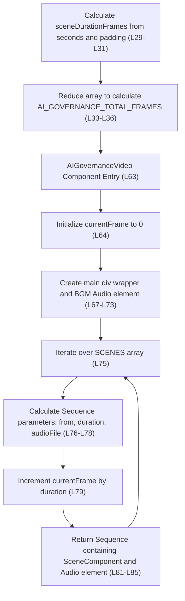

# Logic Flow: AIGovernanceVideo

**Analysis Date**: 2026-03-21
**Source File**: [src/AIGovernanceVideo.tsx](src/AIGovernanceVideo.tsx)
**Target Method**: `AIGovernanceVideo` and parent scope constants at Line 29-91
**Complexity**: simple

## Source Code

**Source**: [src/AIGovernanceVideo.tsx:63](src/AIGovernanceVideo.tsx:63)

```typescript
// Line 29-91 from src/AIGovernanceVideo.tsx
const sceneDurationFrames = SCENE_DURATIONS_SEC.map(
  (sec) => Math.ceil(sec * FPS) + PADDING_FRAMES
);

export const AI_GOVERNANCE_TOTAL_FRAMES = sceneDurationFrames.reduce(
  (a, b) => a + b,
  0
);

// ... arrays omitted for brevity ...

export const AIGovernanceVideo: React.FC = () => {
  let currentFrame = 0;

  return (
    <div style={{ flex: 1, backgroundColor: '#0D1117' }}>
      {/* BGM track — cut from 1:14, looped to cover entire video */}
      <Audio
        src={staticFile('audio/bgm_fastboi_from114.mp3')}
        volume={BGM_VOLUME}
        loop
      />

      {SCENES.map((SceneComponent, i) => {
        const from = currentFrame;
        const duration = sceneDurationFrames[i]!;
        const audioFile = AUDIO_FILES[i]!;
        currentFrame += duration;

        return (
          <Sequence key={i} from={from} durationInFrames={duration}>
            <SceneComponent />
            <Audio src={staticFile(audioFile)} />
          </Sequence>
        );
      })}
    </div>
  );
};
```

## Logic Flowchart



## Node-to-Line Mapping

| Node | Description | Source Line | Code Snippet | Notes |
|:-----|:------------|:-----------|:-------------|:------|
| InitArrays | Time Conversion | L29-L31 | `const sceneDurationFrames = ... Math.ceil(sec * FPS) + PADDING_FRAMES` | Converts standard timestamps plus 15 frames padding into frame counts |
| MapTotal | Total Runtime math | L33-L36 | `sceneDurationFrames.reduce((a, b) => a + b, 0);` | Determines the `durationInFrames` for the root Composition |
| ComponentEntry | Function call | L63 | `export const AIGovernanceVideo = () => {` | |
| SetFrameStart | Setup local var | L64 | `let currentFrame = 0;` | Serves as the rolling sum sequencer |
| ReturnWrapper | Render Start | L67-L73 | `<div...><Audio src=... loop />` | Establishes container and base BGM track |
| MapScenes | Scenes loop | L75 | `{SCENES.map((SceneComponent, i) => {` | |
| CalcOffsets | Config preparation | L76-L78 | `const from = currentFrame; const duration...` | Pulls configured values for the iteration |
| AdvFrame | State update | L79 | `currentFrame += duration;` | Sets up the `from` property for the NEXT iteration |
| RenderScene | Scene wrapper | L81-L85 | `<Sequence...><SceneComponent /><Audio.../></Sequence>` | The actual content block pushed to React |

## Side Effects Summary

**State mutations:**
| Variable | Line | Operation | New Value | Scope |
|:---------|:-----|:----------|:----------|:------|
| `currentFrame` | L79 | Increment | `currentFrame + duration` | Component |

## Question List

### Suspected Issues
- [ ] None identified. Flow is straightforward React functional logic for Remotion sequences.
