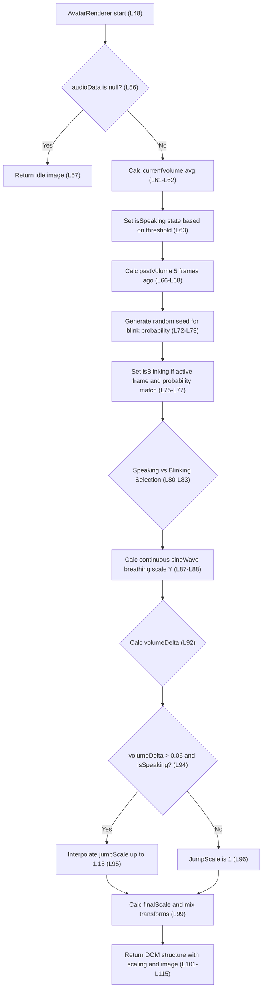

# Logic Flow: Avatar

**Analysis Date**: 2026-03-21
**Source File**: [src/components/Avatar.tsx](src/components/Avatar.tsx)
**Target Method**: `AvatarRenderer` at Line 48-116
**Complexity**: medium

## Source Code

**Source**: [src/components/Avatar.tsx:48](src/components/Avatar.tsx:48)

```typescript
// Line 48-116 from src/components/Avatar.tsx
const AvatarRenderer: React.FC<AvatarProps & { audioData: any; frame: number; fps: number }> = ({
  characterDef,
  threshold = 0.05,
  width = 600,
  audioData,
  frame,
  fps,
}) => {
  if (!audioData) {
    return ;
  }

  // 現フレームの音量レベルを解析
  const audioVisualizer = visualizeAudio({ fps, frame, audioData, numberOfSamples: 16 });
  const currentVolume = audioVisualizer.reduce((acc, val) => acc + val, 0) / audioVisualizer.length;
  const isSpeaking = currentVolume > threshold;
  
  // Bounce効果用: わずかに前(5フレーム前)の音量を解析し、閾値を跨いだ立ち上がり(Bounceトリガー)を検知
  const pastFrame = Math.max(0, frame - 5);
  const pastAudioVisualizer = visualizeAudio({ fps, frame: pastFrame, audioData, numberOfSamples: 16 });
  const pastVolume = pastAudioVisualizer.reduce((acc, val) => acc + val, 0) / pastAudioVisualizer.length;

  // 1. 決定論的 擬似ランダム瞬きロジック
  // 秒(セグメント)の切り替わりごとにシード値を固定して乱数を生む
  const secondIndex = Math.floor(frame / fps);
  const blinkProb = random(`blink-${secondIndex}`);
  // 約30%の確率で、その秒の最初の4フレーム(1/15秒)だけ瞬きを行う
  const isBlinkSecond = blinkProb < 0.3;
  const frameInSecond = frame % fps;
  const isBlinking = isBlinkSecond && frameInSecond < 4;

  // 画像の選択 (veadotube mini の4ステート構造)
  let targetImage = characterDef.idle;
  if (!isBlinking && isSpeaking) targetImage = characterDef.speaking;
  else if (isBlinking && !isSpeaking) targetImage = characterDef.blinkIdle;
  else if (isBlinking && isSpeaking) targetImage = characterDef.blinkSpeaking;

  // 2. 呼吸ループアニメーション (Sine波によるY軸7%の伸縮)
  // (Math.sin(frame / 20) + 1) / 2 で 0〜1 の緩やかな波長を作り、最大7%(0.07)の伸びを加える
  const sineWave = (Math.sin(frame / 20) + 1) / 2;
  const breathingScaleY = 1 + (sineWave * 0.07);

  // 3. Bounce(跳ね) リアクションロジック
  // 音量が閾値を超えた(急激に上がった)瞬間の差分からバウンス強度を計算
  const volumeDelta = currentVolume - pastVolume;
  // 単語ごとの不自然なピクつきを防ぐため、バウンス(跳ね)発動の閾値を「0.06以上急激に音量が上がった瞬間」に厳しく限定
  const jumpScale = (isSpeaking && volumeDelta > 0.06) 
    ? interpolate(volumeDelta, [0.06, 0.15], [1, 1.15], { extrapolateRight: 'clamp', extrapolateLeft: 'clamp' }) 
    : 1;
  // 話している最中に音量の強弱で常時ブルブルと拡大縮小し続けるのを見苦しくないよう、等倍(1)に固定
  const baseScale = 1;
  const finalScale = Math.max(baseScale, jumpScale);

  return (
    <div
      style={{
        width,
        display: 'flex',
        justifyContent: 'center',
        alignItems: 'center', // 画像をコンテナ中央に固定
        // 全体の跳ねスケール(finalScale)に、Y軸のみ呼吸用スケール(breathingScaleY)を乗算
        transform: `scale(${finalScale}, ${finalScale * breathingScaleY})`,
        transformOrigin: 'center center', // 画像中央を固定して伸縮
      }}
    >
      
    </div>
  );
};
```

## Logic Flowchart



## Node-to-Line Mapping

| Node | Description | Source Line | Code Snippet | Notes |
|:-----|:------------|:-----------|:-------------|:------|
| Start | Method Entry | L48 | `const AvatarRenderer: React.FC...` | Component properties destructuring |
| CheckAudio | Null check for audio data | L56 | `if (!audioData) {` | Stops visualizer when no audio metadata exists |
| ReturnIdle | Default renderer | L57 | `return  threshold;` | Threshold dictates active speaking flag |
| MapPastVolume | Historical context generation | L66-L68 | `const pastFrame = Math.max(0, frame - 5);` | Uses frame buffering of 5 frames |
| BlinkingLogic | Temporal deterministic RNG | L72-L73 | `const blinkProb = random(blink-${secondIndex});` | 1 value per second of output via Remotion random |
| SetBlinking | Sub-second active blink calc | L75-L77 | `const isBlinkSecond = blinkProb < 0.3;` | Targets specifically the first 4 frames of matching seconds |
| CondTargetImg | Image state machine | L80-L83 | `if (!isBlinking && isSpeaking) targetImage = characterDef.speaking;` | veadotube mini standard format matching |
| ScaleBreathing | Ambient logic | L87-L88 | `const sineWave = (Math.sin(frame / 20) + 1) / 2;` | Trigonometric generation over time |
| ScaleBounce | Impulse math | L92 | `const volumeDelta = currentVolume - pastVolume;` | First derivative approximation logic |
| CondBounce | Thresholding bounce logic | L94 | `const jumpScale = (isSpeaking && volumeDelta > 0.06)` | Noise gate filter |
| SetJumpScale | Scale interpolation remap | L95 | `interpolate(volumeDelta, [0.06, 0.15], [1, 1.15]...` | Range clamping and expansion mapping |
| SetDefaultScale | Fallback identity mapping | L96 | `: 1;` | |
| FinalCombine | Final composition scale selection | L99 | `const finalScale = Math.max(baseScale, jumpScale);` | Combine base size, limits shrinkage |
| ReturnDiv | Component Output | L101-L115 | `return (<div style={{ transform: ...}}></div>);` | |

## Side Effects Summary

**State mutations:**
| Variable | Line | Operation | New Value | Scope |
|:---------|:-----|:----------|:----------|:------|
| `targetImage` | L80-L83 | Reassignment | Image paths (idle/speaking/etc) | Local block |
| `currentFrame` | L31 | Read state | Remotion framework external | Read only |

## Question List

### Suspected Issues
- [ ] **Bounce Jump Math Filtering** — [src/components/Avatar.tsx:94](src/components/Avatar.tsx:94)
  Does limiting `volumeDelta` to positive-only rising slopes cleanly handle audio peak ringing vs sharp plosives? Requires audio edge-case testing.
